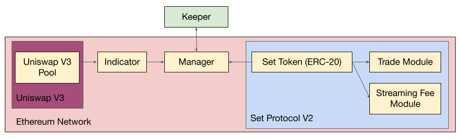

# Multiple Moving Average Set Token

Tokenize a smart contract managed multiple moving average crossover trading strategy with [Set Protocol V2](https://docs.tokensets.com/) and [Uniswap V3 oracles](https://docs.uniswap.org/protocol/concepts/V3-overview/oracle). 

## Installing Dependencies

### Node

```bash
npm install @openzeppelin/contracts@3.1.0
```

```bash
npm install @setprotocol/set-protocol-v2
```

```bash
npm install @setprotocol/index-coop-contracts
```

```bash
npm install @uniswap/v3-core
```

## Implementation Details

### Contract Architecture



The `Indicator` contract utilizes a `Uniswap V3 Pool` as an on-chain oracle. 

The `Manager` contract has two key functions for the `Keeper`
- `getIndicatorIsChanged()`, which can be called for free and checks if the `Indicator` signal has changed since the last rebalance
- `rebalance()`, which can only be called by the `Keeper` and utilizes the `Trade Module` to change the allocation of the `Set Token`

The `Keeper` can be set to periodically call `getIndicatorIsChanged()` for free, and subsequently call `rebalance()` if the indicator signal has changed. 

### Multiple Moving Average Crossover Indicator

Consider two groups of moving averages: S, a group of n short term moving averages and L, a group of m long term moving averages. 

S = [S1, S2, ..., Sn]

L = [L1, L2, ..., Lm]

An indicator MMA() can be constructed as follows
- bullish if min(S) > max(L)
- bearish if max(S) < min(L)
- uncertain otherwise

The uncertain case, when the short term and long term groups of moving averages overlap, can be considered either bullish (risk-on) or bearish (risk-off) depending on manager preference. 

### Uniswap V3 Oracles

This indicator uses a Uniswap V3 pool as on-chain oracle by deriving the arithmetic mean tick over an interval and using that as a moving average. The arithmetic mean tick over a given interval is derived with values stored in the [tick accumulator](https://docs.uniswap.org/protocol/concepts/V3-overview/oracle#tick-accumulator).  

### Trading Strategy

With a risk-on asset (ex: $ETH) and a risk-off asset (ex: $USDC) the trading strategy is as follows
- hold $ETH when MMA() using the Uniswap V3 ETHUSDC pool is bullish
- hold $USDC when MMA() using the Uniswap V3 ETHUSDC pool is bearish or uncertain

## Future Work

- Place calls to tradeModule in a more optimal way (reduce slippage)
- Gas optimization in indicator
- Add Aave/Compound lending (wrapModule) to manager

## Acknowledgements
* [Set Protocol V2](https://docs.tokensets.com/): [[GitHub](https://github.com/SetProtocol/set-protocol-v2)]
* [Uniswap V3](https://uniswap.org/whitepaper-v3.pdf): [[GitHub](https://github.com/Uniswap/v3-core)] [[Oracle Documentation](https://docs.uniswap.org/protocol/concepts/V3-overview/oracle)]
